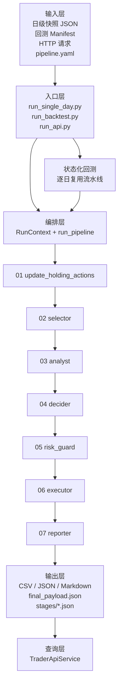
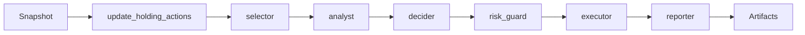

# AI Trader 架构说明

本文帮助你快速理解项目的运行方式、模块分层，以及单日/API/回测三种调用模式之间的关系。

## 1. 总体架构



核心特点：

- **一套流水线，多种入口**：单日、API、回测最终都走 `run_pipeline`
- **阶段注册化**：各环节通过 stage registry 注册，pipeline 可按 preset 或显式 stage list 组合
- **文件驱动**：所有结果落盘，方便回放和审计
- **职责分层清晰**：`selector` 和 `risk_guard` 保持规则化，`executor` 保持确定性模拟，其他核心判断环节由 live LLM agent 驱动
- **失败语义明确**：`selector / risk_guard / executor` 保留 fallback；`update_holding_actions / analyst / decider / reporter` 要求 live LLM 可用，否则直接报错

## 2. 三种入口模式

### 2.1 单日运行

入口文件：`run_single_day.py`

适合：

- 调试输入数据
- 验证配置参数
- 查看中间产物

输出目录：

```text
outputs/<run_id>/
```

### 2.2 HTTP API

入口文件：`run_api.py`

适合：

- 本地脚本或调度系统集成
- 查询已有产物

API 服务本身不维护数据库，而是**扫描输出目录**并返回最新结果。

### 2.3 状态化回测

入口文件：`run_backtest.py`

适合：

- 复用单日流水线做 walk-forward 回测
- 连续传递 `cash / positions / peak_equity`
- 对比不同配置在多日样本上的表现

输出目录：

```text
outputs/backtests/<run_id>/
```

## 3. 运行时分层

### 3.1 入口层

- `run_single_day.py`：读取单日快照，构造 `RunContext`
- `run_api.py`：启动 HTTP 服务
- `run_backtest.py`：逐日构造快照并复用单日流水线

### 3.2 编排层

- `app/pipeline/context.py`：封装 `run_id`、`trade_date`、配置路径、输出目录
- `app/pipeline/stages.py`：维护 stage registry、preset 和依赖声明
- `app/pipeline/io.py`：封装阶段输入访问器，统一读取 payload 中的共享字段
- `app/pipeline/artifacts.py`：统一维护 stage 到文件产物的导出逻辑
- `app/runner.py`：按解析后的 pipeline 顺序执行阶段，并做输入依赖、输入形状、stage 输出形状与 artifact 输出契约校验
- `app/config/loader.py`：基于 `PyYAML` 加载配置，并支持 `extends` 方式做 base / overlay 合并

### 3.3 组件层

位于 `app/components/`，是真正的业务处理核心。

### 3.4 适配层

位于 `app/adapters/`：

- `storage.py`：JSON / CSV / 文本读写
- `llm.py`：live LLM 请求、Responses 解析与错误包装

### 3.5 规则与通用层

- `a_share.py`：A 股板块、涨跌停、整手、费用等规则
- `contracts.py`：各类 CSV 输出字段定义
- `utils.py`：数值转换、Sharpe、回撤等工具
- `domain/`：领域模型和枚举

## 4. 单日流水线说明

### 4.1 阶段一览

| 阶段 | 输入关注点 | 主要职责 | 主要输出 |
| --- | --- | --- | --- |
| `update_holding_actions` | 账户、已有持仓、近期事件 | 计算 HOLD / REDUCE / EXIT、标准化持仓、识别 T+1 | `holding_actions_t.csv` |
| `selector` | 观察池 `watchlist` | 计算技术分与流动性过滤 | `tech_candidates_t.csv` |
| `analyst` | 候选、事件、基本面 | 生成 `BUILD / ADD / HOLD` 倾向与论点 | `ai_insights_t.csv` |
| `decider` | 持仓动作 + AI 结论 | 合并为候选订单草案 | `orders_candidate_t.csv` |
| `risk_guard` | 候选订单、账户、风控配置 | 仓位上限、T+1、停牌、ST、回撤保护 | `trade_plan_t.csv` |
| `executor` | 交易计划、行情视图 | 模拟成交、费用、持仓和净值变化 | `sim_fill_t.csv`、`positions_t.csv`、`nav_t.csv` |
| `reporter` | 全链路结果 | 汇总指标与风险报告 | `metrics_t.json`、`risk_report_t.md` |

### 4.2 流水线时序



### 4.3 组合方式

编排层支持两种组合方式：

1. `pipeline.preset`
2. `pipeline.stages`

优先级为：

1. 运行时覆写 `pipeline_stages`
2. 配置文件 `pipeline.stages`
3. 运行时覆写 `pipeline_preset`
4. 配置文件 `pipeline.preset`
5. 默认 `full`

运行时如果发现某个 stage 的输入不在初始 payload、也不由前序 stage 提供，或者字段类型不符合约定，会直接拒绝执行。

对于已完成 DTO 化的阶段，catalog 还会暴露 `output_model` 和 `output_contract`，便于识别哪些环节已经脱离“裸 dict 输出”，以及每个输出键对应什么行模型。当前主链路的大部分 stage 已经接入这一层，其中 `selector / holding_review / decider / risk_guard / executor / reporter` 都已具备明确输出契约。

### 4.4 Artifact 导出

各业务 stage 当前只负责生成 payload 增量，不直接写 `CSV / JSON / Markdown`。

统一导出流程由编排层负责：

1. 执行 stage
2. 仅基于该 stage 的输出和对应的 artifact view，调用 artifact registry 导出文件产物
3. 写入 `stages/<index>_<stage>.json`

这样做的好处是：

- stage 可以更容易做单测
- 后续可替换为内存执行、对象存储或数据库持久化
- 组合 pipeline 时不需要把文件系统副作用混进业务逻辑

### 4.5 中间产物

每个阶段执行后，都会额外写入：

```text
outputs/<run_id>/stages/01_update_holding_actions.json
outputs/<run_id>/stages/02_selector.json
...
outputs/<run_id>/stages/07_reporter.json
```

这些 stage dump 现在是紧凑结构，主要包含：

- 该阶段的关键输入快照
- 该阶段输出增量
- artifact manifest
- stage 元信息和说明

这样既保留了审计能力，也避免每一步都重复写整份累计 payload。

## 5. API 与输出目录的关系

API 只负责两件事：

1. 触发一次单日同步运行
2. 读取 `outputs/` 中已有产物

因此它的读取语义是：

- 单日输出扫描 `outputs/<run_id>/`
- 回测逐日输出扫描 `outputs/backtests/<run_id>/days/<trade_date>/`
- 对同一个 `trade_date`，按目录更新时间选“最新结果”

## 6. 回测为什么能复用单日流水线

回测并没有单独实现一套决策逻辑，而是：

1. 先根据 manifest 生成每日 snapshot
2. 可选把上一日 `cash / positions / peak_equity` 注入下一日 snapshot
3. 对每一天调用同一个 `run_pipeline`
4. 再把每日 `nav / fills / metrics` 汇总成组合级报告

好处是：

- 单日与回测逻辑一致
- 修复一个阶段，单日与回测同时受益
- 更容易做回放和日级定位

## 7. 建议阅读顺序

如果你第一次接触这个仓库，建议按顺序阅读：

1. `README.md`
2. `docs/architecture.md`
3. `docs/api-mvp.md`
4. `docs/product-roadmap.md`
